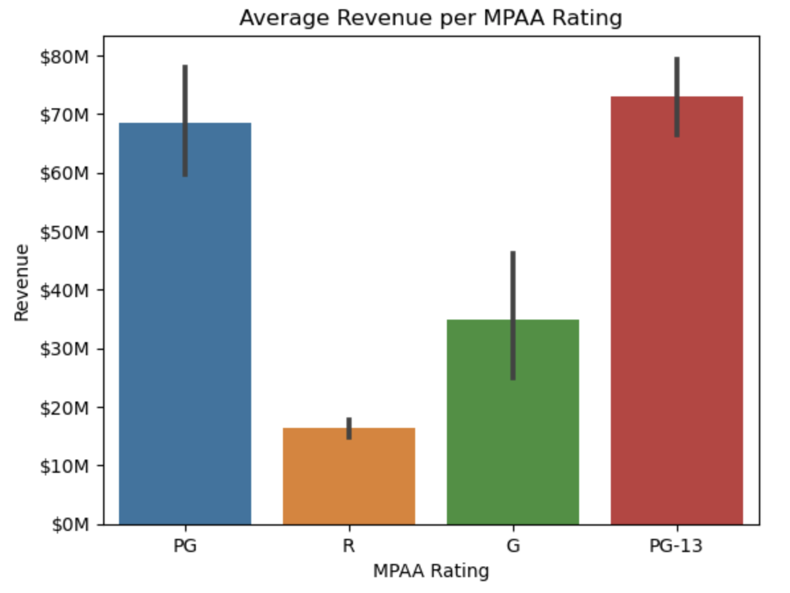
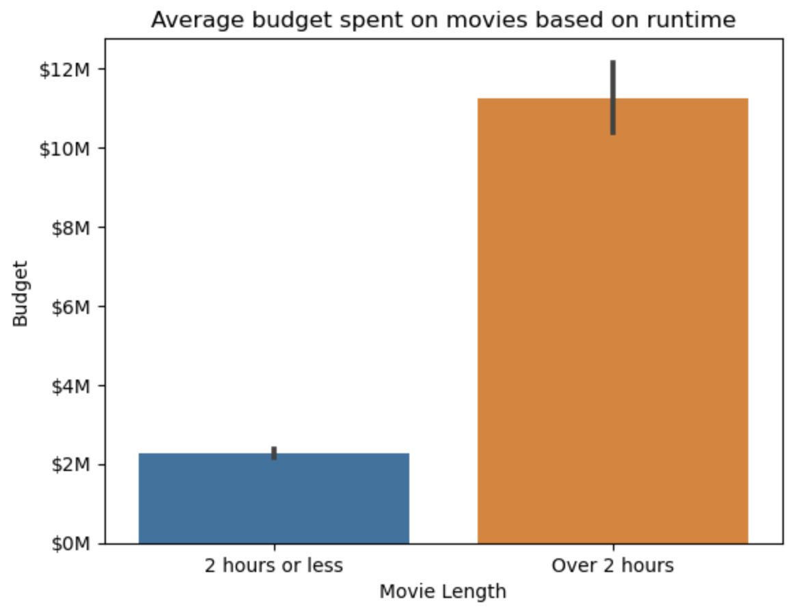
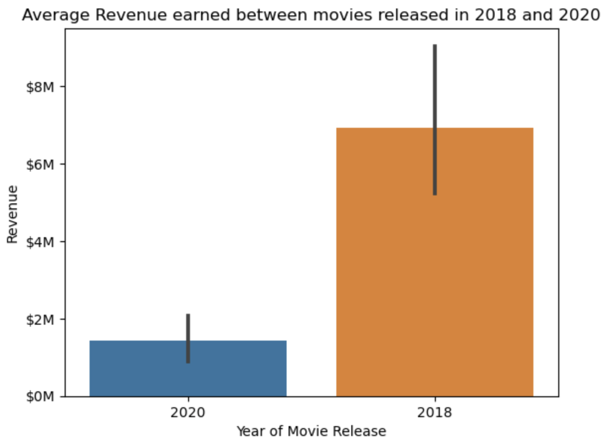

# IMDB Movie Analysis
 
Main Objective: We produced a MySQL database on Movies from a subset of IMDB's publicly available dataset. We used this database to analyze what makes a movie successful, and provide recommendations on how to make a successful movie.

## Key Steps

- Downloaded several files from IMDB’s movie dataset and filtered out a requested subset of movies.
- Used an API to extract box office revenue and profit data to add to our IMDB data and perform exploratory data analysis.
- Constructed and exported a MySQL database using our data.
- Applied hypothesis testing to explore what makes a movie successful (after cleaning data appropriately).
- Produced a Linear Regression model to predict movie performance.

Data Sources:

https://www.imdb.com/interfaces/

https://datasets.imdbws.com/

Data Dictionary:

https://developer.imdb.com/non-commercial-datasets/

## Statistical Analysis

- All p-values are 0.05
- Outliers were removed

### Does the MPAA rating (G/PG/PG-13/R) affect how much revenue a movie generates?

- Null Hypothesis: There is no significant statistical difference between the revenue generated by movies with different MPAA ratings.

- Alternate Hypothesis: There is a significant statistical difference between the revenue generated by movies with different MPAA ratings.

- ANOVA test used since we are comparing numerical data between more than two groups.

- Distribution Normality assumption failed, but can be ignored due to sufficiently large group sizes.

- Equal Variance assumption failed so we used the nonparametric Kruskal-Wallis test.

- Hypothesis test result and visualization: Reject the null hypothesis.

- Tukey's multiple comparison test confirmed there were significant differences in revenue between all certification pairs except PG and PG-13.

### How does the budget for movies that are over 2 hours long compare with movies that are less than or equal to 2 hours?

- Null Hypothesis: There is no significant statistical difference between the budget spent on movies based on runtime.

- Alternate Hypothesis: There is a significant statistical difference between the budget spent on movies based on runtime.

- Two sample t-test used since we are comparing numerical data between two groups.

- Distribution Normality assumption failed, but can be ignored due to sufficiently large group sizes.

- Equal Variance assumption failed by the Levene test.

- Hypothesis test result and visualization: Reject the null hypothesis using Welch's T-test.

- On average, movies with runtime of:
- - 2 hours or less spent $2,275,707
- - Over 2 hours spent $11,250,690

 
 ### Do movies released in 2020 earn less revenue than movies released in 2018?

- Null Hypothesis: There is no significant statistical difference between the revenue earned by movie released in 2018 and 2020.

- Alternate Hypothesis: Movies released in 2020 statistically earn significantly less revenue than movies released in 2018 (due to pandemic).

- Two sample t-test used since we are comparing numerical data between two groups.

- Distribution Normality assumption failed, but can be ignored due to sufficiently large group sizes.

- Equal Variance assumption failed by the Levene test.

- Hypothesis test result and visualization: Reject the null hypothesis using Welch's T-test.

- On average, movies with runtime of:
- - 2020 earned $1,434,186
- - 2018 earned $6,938,894

 
 ## Linear Regression Model
 
 - Homoscedasticity
